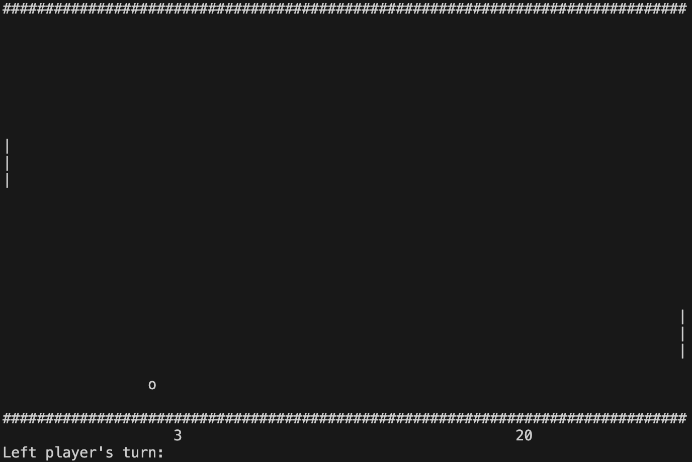

## 🏓 Game Pong

### A turn-based terminal game for two players similar to the game "Pong".
🚀 Developed in a structured programming style in pure C language.

### 🏁 Start the Game

* To start the game - use `make build` and after `make start`.

### 🕹️ Game controls
  
* A/Z to move the left player's racket up/down.
* K/M to move the right player's racket up/down.
* Space Bar to skip action.

### ⚙️ It is possible to customize the size of the playing field

* WIDTH_FIELD - field width
* HEIGHT_FIELD - field height
* START_BALL_DIR_Y - initial vert. eg ball movement 1-down, -1-up
* START_BALL_DIR_X - initial horizon. eg ball movement 1-right, -1-left
* MAX_SCORE - the maximum score up to which we play, after which the winner will be announced and the game will end

### ℹ️ Info

* [Coverage analyzed during game test](tests/LCOV - report.pdf)
* You also can check it by `make test` and `make gcov-report`
